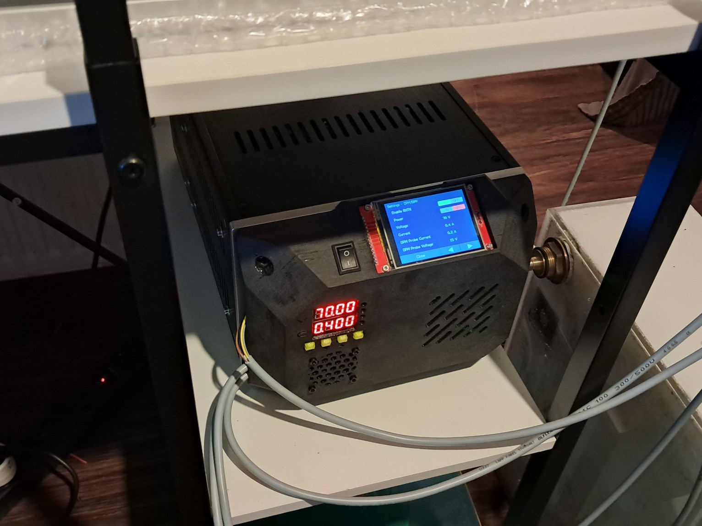
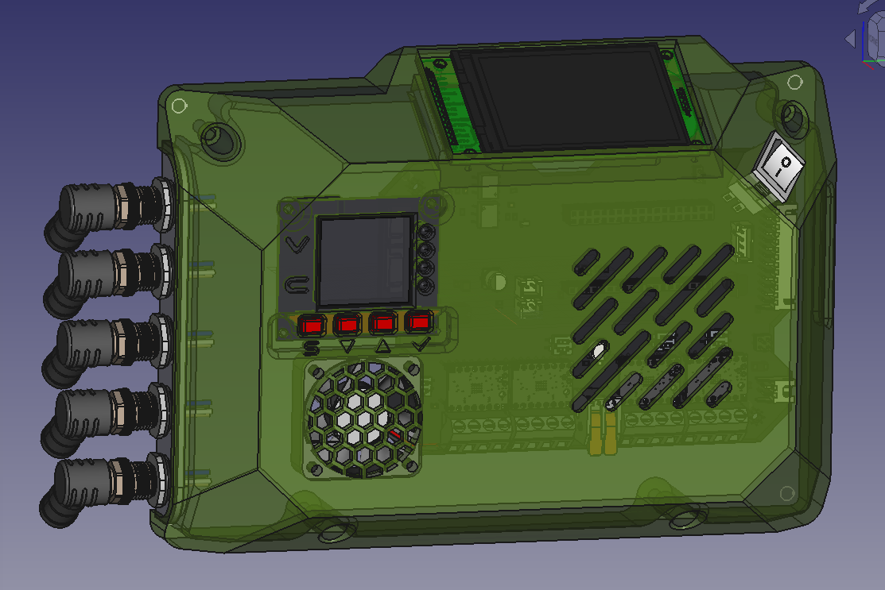

# EVOIII-Controlpanel
A quick solution to make a control panel with a 2.8" ILI9341 display. 
  
# Created with FreeCAD 1.0.0
The project file is for FreeCADs new 1.0.0 version.
  

  

# Printsettings
8mm Brim 
Brim on outside only 
Normal supports touching buildplate 
70% infill 
2 or 3 walls (I think I used 2 walls) 
Inner walls first (this is important for the overhangs) 
Add adhesive on the printbed. I use hairspray.  

It should fit on an Ender but it is a very tight fit.
